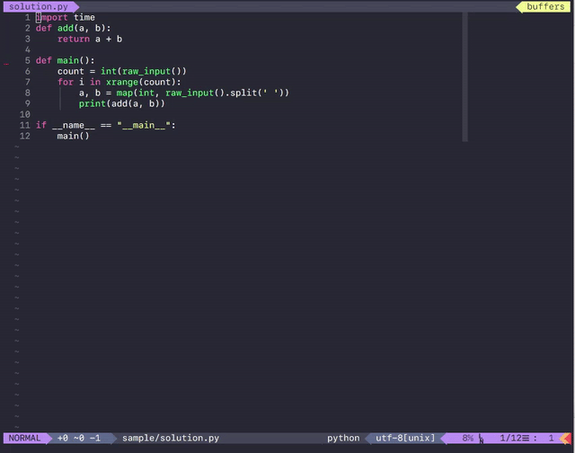
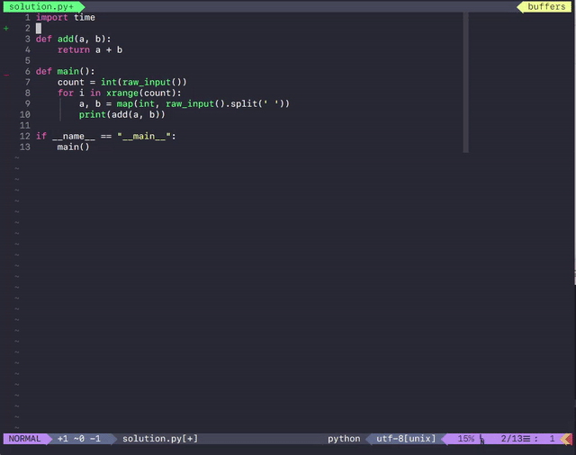
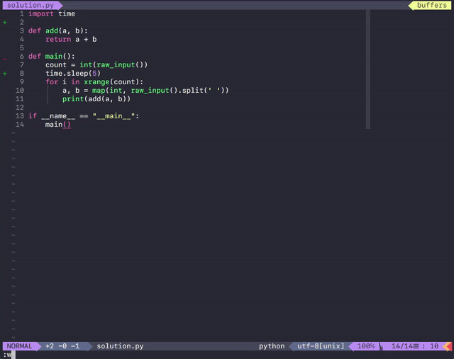
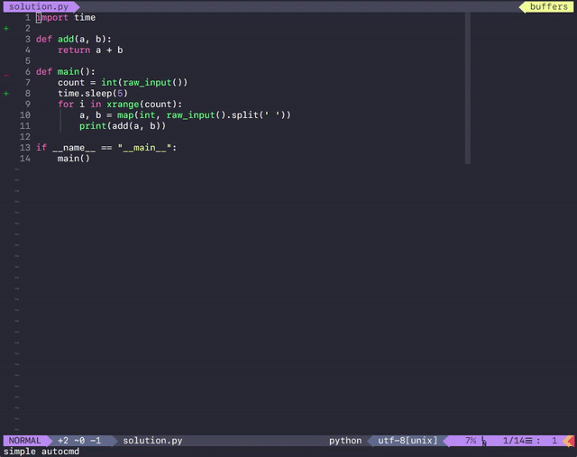

name: title
class: middle, center, inverse

.pycon_logo[]
# .title_upper[Python으로 만드는]<br>NEOVIM ASYNC PLUGIN

.author[송재학 ([master@hpi.cc](mailto:master@hpi.cc))]

---
class: middle

# 발표자

## 송재학

* 현재 백수이지만 열심히 살고 있습니다.

* (전) 문래빗 주식회사 대표
  * 판타지x러너즈 for 카카오 서버 개발 (python)

* omnisharp-sublime (sublime text를 위한 C# IDE 플러그인)

---

class: center, middle

### 저는 오랫동안 vim을 주력 에디터로 쓰고 **싶었습니다.**

#### vim은 정말 위대한 텍스트 에디터이지만
#### 매우 주관적인 장애물이 좀 있었습니다.

???
그래서 결국 vim을 직접 사용하는 경우는 드물었고, sublime text나 atom과 같은
텍스트 에디터에 vim 키바인딩을 사용하곤 했었죠.

그럼, 어떤 장애물이 있었을까요?


---
class: middle

.logo[
  
]

* 로고에 그라데이션이 없음

* 힙하지 않음

* VimScript 코딩하기 싫음

* ** 대부분의 플러그인이 sync로 동작하여, 플러그인에 의해 쉽게 느려짐 **

???

# 그라데이션

* 그라데이션은 중요함.

# 힙
* 25년 전에 릴리즈된 프로젝트. 
* 지금 힙하다고 볼 수는 없음.


# VimScript
* 물론 +python 옵션을 넣은채로 빌드하면 vim에서도 파이썬 사용가능.
* 그래도 VimScript와 하이브리드로 쓰는 것
* VimScript를 피할 수는 없음

# 그래도
* 조금만 양보하면 되는 문제들

# sync

* 이건 심각한 문제
* async로 만들 수 있는 부분은 한정적
* 플러그인 떡칠하고 싶은데...
* Unity C# 코딩, 자동 완성 없으면 힘듬
    * but, vim에서 C# 자동완성을 붙이면 너무 느려짐 
    * 결국 sublime text에 C# 비동기 자동완성 플러그인을 만들어 쓰기로 함.


---
class: center, middle

.logo[
  
]


???

* 그리고 어느날 neovim을 알게 됨

--

class: center, middle
## 말그대로 Vim의 미래
Vim을 적극적으로 리팩토링한 superset


???

* 한마디로 neovim은 'vim의 미래'

* vim을 적극적으로 리팩토링한 superset 프로젝트 

* 보는 순간 관심이 생기기 시작함 

---
class: middle

.logo[
  
]

* 로고에 그라데이션이 있는가? **(O)**

--

* 힙한가? **(O)**

--

* **VimScript 없이 Python으로 플러그인 개발을 할 수 있는가? (O)**

--
* **Async 플러그인 개발이 쉬운가? (O)**

???
핵이득! 사용해볼 가치가 있음

---

class: center, middle

### 다 좋은데, 안정적일까?

---

class: middle
# 현황
#### (2016.08.12 기준)

* stable version: v0.1.4

  * 현재 안정적이고 실사용 가능.

???

* v0.1.0 목표가 stable한 빌드였음.
* 그 이후로도 4번이나 릴리즈됨

---
class: center, middle

### 어느날 갑자기 망하지는 않을까?

???

* 아무리 좋은 오픈소스 프로젝트라도 인기가 시들하면 지속적인 생명력을 갖기 어려움

--


???

* 핫하다!
* 이미 많은 사람들이 관심을 가지고 있음


---

class: center, middle


.logo[
  

]

## 지금 당장 Neovim을 설치해야겠다! 

???
* 결국 neovim에 유혹에 굴복하고, 사용하게 되었음.
* 그 뒤, 약 반년동안 주력 에디터로 만족스럽게 사용 중.
* 하지만, neovim이 저런 장점만 있는 것은 아님
  * 로고를 새로 예쁘게 만들거나
  * 힙스터들 꼬시려고 새로 만들지는 않았을 것

---

class: middle
# 특징 

공식 사이트에 따르면...

- **더 강력한 플러그인**

- 더 나은 기본 기능과 설정 

- 기본으로 내장된 embedding

- Vim에서 쉽게 옮길 수 있음

???
* 공식 사이트 메인에 가면 저런 내용을 볼 수 있음

# 더 강력한 플러그인
* 앞으로 다룰 내용이라 생략

# 더 나은 기본 기능과 설정
* 기본 설정이 더 실용적이고 강력하게 되어있음
* 현대적인 터미널 기능 - 트루컬러, 브라켓드 패이스트
* 터미널 에뮬레이터가 빌트인 되어있음

# 기본으로 내장된 embedding
* nvim --embed를 통해 GUI 어플리케이션에 내장될 수 있음
  * 실제로, atom에 neovim을 embed해서 vim binding을 구현하는 프로젝트도 있음

# Vim에서 쉽게 옮길 수 있음
* vim의 superset
* 잘 호환됨-플러그인도
* 몇가지 간단한 차이점 외에는 똑같이 사용 가능

---

class: middle

# 더 강력한 플러그인

  * 오늘은 여기에 집중합시다.

???
* 오늘 주제는 NEOVIM ASYNC PLUGIN을 파이썬으로 만드는 것.
* 더 강력한 플러그인에만 집중
* 핵심은 Msgpack-RPC임

---

class: middle

# Msgpack-RPC

 * Neovim은 서버입니다.

 * stdin/stdout, socket 등을 통해 Neovim의 RPC API를 사용할 수 있습니다.

???
* Neovim은 API를 제공하는 서버
* 표준 입출력, 소켓등을 통해 RPC API 사용 가능
* 그래서 거의 모든 언어로 API 호출 가능

---

## 현재 API 클라이언트 모듈이 있는 플랫폼

* C#
* C++
* Clojure
* Common Lisp
* Elixir
* Filesystem
* Go
* Haskell
* Java
* Julia
* Lua
* Node.js
* Perl
* R
* Ruby
* Rust

...

???
* 많다
* 그냥 이렇게 많다는 것만

---

class: middle

# 그리고 당연히 **Python**!!

???
* 당연히 우리의 Python
* 언어의 인기 때문인지, neovim에서 client 중에서도 인기 있는 편
* help에서도 곧잘 Python 예제를 찾아 볼 수 있음
* 한번 써볼까요?

---

class: middle

# Hello World!

???
* 그럼, 당연히 Hello World! 부터 시작
* python-neovim 모듈을 사용해서 "Hello World"를 출력해볼 꺼임.

---

# Hello World!
### 0. python-neovim 설치

```bash
> # neovim의 RPC API을 사용하기  위한 모듈
> pip install neovim
```

### 1. Neovim 실행

```bash
> # NVIM_LISTEN_ADDRESS: neovim의 RPC 주소 지정
> NVIM_LISTEN_ADDRESS=/tmp/nvim nvim
```

### 2. Python 쉘에서 명령어 실행

``` python
> python
>>> from neovim import attach
>>> nvim = attach('socket', path='/tmp/nvim')
>>> nvim.command('echo "hello world!"')

```

???
* 당연히 pip으로 모듈 설치
* nvim을 실행
  * 근데, 소켓을 활용해서 Python 쉘과 연결할 것이므로, 어드레스 지정
  * 환경변수 지정 가능
  * 디버깅에도 유용함
* attach 하고
* nvim.command로 Neovim의 커멘드를 호출해줌.
  * vim 사용하는 사람은 알겠지만, 콜론하고 커맨드 입력하는 것과 같음

---

# Hello World!


???
* 여기 작고 초라하게 헬로월드가 떴음
* 작은 한걸음이지만 큰 도약임

---

class: middle

## 왜 Python REPL을 사용한거죠?

* 부담 없이 API를 테스트 해볼 수 있습니다.

* help 함수로 API 문서를 즉석에서 확인할 수 있습니다.

* 디버깅할 때도 유용함

???

* 그럼 이제 플러그인에 대해서 소개하겠음.

---

class: middle
# "REMOTE PLUGIN"
## Neovim의 Msgpack-RPC를 통해 동작하는 플러그인

???
* Neovim에는 Remote Plugin이라는 개념이 있음
* subprocess로 각 플러그인 별 프로세스를 실행해주고
  * Msgpack-RPC로 서로 통신함
* 이는 장점이 많음
  * 어떤 언어로든 플러그인 개발 가능
  * 플러그인과 neovim의 프로세스가 분리됨
      * async하게 동작함
      * 안정적임

---
class: middle

## 간단한 리모트 플러그인을 만들어 봅시다.
### 파일 하나만 있으면 됩니다.

???
* 정말로
  * vim 파일 필요없고
  * 따로 연결해주기 위한 설정도 필요 없음
  * 적절한 경로에 파일 하나만 들어주면 됨

---

class: middle

## SimplePlugin 플러그인 예제

```python
# ~/.config/nvim/rplugin/python/simple.py

import neovim

@neovim.plugin
class SimplePlugin(object):

    def __init__(self, nvim):
        self.nvim = nvim

    @neovim.function('SimpleFunc')
    def func(self, args):
        self.nvim.command('echo "simple func"')

    @neovim.command('SimpleCommand', range='', nargs='*')
    def command(self, args, range):
        self.nvim.command('echo "simple command"')

    @neovim.autocmd('BufEnter', pattern="*.py")
    def autocmd(self):
        self.nvim.command('echo "simple autocmd"')
```

???
* 진짜 이게 다임
* 실은 하는게 없는 코드라서 그럼
* 아마 다들 보는 순간 100% 파악하셨을꺼임
* python이 기본 언어인 sublime text보다도 간단함


# 코드 설명
* 다들 필요없으시겠지만, 그래도 시간을 채우기 위해 설명하겠음
* 그냥 모듈 가져오고
* plugin 클래스 선언해주고
* function 등록함
* command 등록함
* autocmd 등록함 (이건 이벤트 처리용으로 많이 쓰임)

등록한 function, command는 자동으로 바인딩되서 VimScript로 짠 것처럼 사용 가능.
VimScript 안써도 되서 좋음

그냥 이 파일을 경로에 추가한 뒤,

---

class: middle
### 파일 작성 후, neovim상에서
```vim
:UpdateRemotePlugins
```
### 해주면 플러그인이 동작합니다!

---

class: middle, center


???
* 참 쉽죠?
* 너무 쉬워서 밥 선생님이 안어울림

---

class: middle

## 이제,

--

 1. nvim의 RPC API를 파이썬 쉘에서 실행해볼 수 있습니다.
 
--

 2. 리모트 플러그인을 만들 수 있습니다.
     1. 함수를 만들 수 있습니다.
     2. command를 만들 수 있습니다.
     3. 이벤트를 처리할 수 있습니다. (autocmd)


---

class: middle, center


### 본격적으로 플러그인을 만들 준비가 되었습니다!

---

class: middle

## 플러그인 만들어보기

???
* 실용적인 플러그인 만들기
* 개인적인 용도로 만드는 것

---

class: middle

## 사례

* 덕룡이는 최근 Python으로 알고리즘 문제를 풀고 있습니다.

* 그런데, 제대로 풀었는지 확인하기가 너무 귀찮습니다. 

* 코드를 저장할 때마다 자동으로 체점이 되었으면 합니다.

???
* 덕룡이는 제 친구임
* 파이콘에 안온다고 하길레 마음놓고 이름을 도용함

---

class: middle

### 우리가 해결할 수 있을 것 같습니다!

---
class: middle

## 채점 스크립트 만들기

* Neovim을 켭니다.

???
* 우선 채점을 위한 스크립트 부터 개발해야함

--


???
* 그리고 자세한 설명은 생략하겠습니다.


---
### 완성된 스크립트

```bash
    > python checker.py solution.py
    ==============================
    input
    ==============================
    3
    1 1
    2 2
    3 3

    ==============================
    expected output
    ==============================
    2
    4
    6

    ==============================
    output
    ==============================
    2
    4
    6

    ==============================
    run time: 0.039005
    ==============================
    succeed!
```

???

* 문제를 푼 소스 코드를 받아서
* input을 넣어주고 output과 대조해주는 스크립트
---
class: middle

## 플러그인 만들기

* 이 스크립트를 Vim에 붙여봅시다.

---
class: middle

### 커맨드 만들기

```vim
:CheckSolution <file 경로>
```

로 실행할 수 있는 커맨드를 만들어 봅시다.

???
우선 간단하게 만들어봅시다.

---
class: middle

### 커맨드 만들기

```python
import neovim
import os
from .checker import check

@neovim.plugin
class AlgoTestPlugin(object):

    def __init__(self, nvim):
        self.nvim = nvim
```
플러그인 클래스를 정의해주고,

---

class: middle

### 커맨드 만들기

```python
    @neovim.command('CheckSolution', nargs='*')
    def command(self, args):
        for filename in args:
            dirname = os.path.dirname(filename)
            inputfile = os.path.join(dirname, 'input.txt')
            outputfile = os.path.join(dirname, 'output.txt')

            result = check(filename, inputfile, outputfile)

            self.nvim.command('echo "%s"' % result)
```
커맨드를 정의해줍니다.

---

### 커맨드 만들기

```vim
:CheckSolution solution.py
```
커맨드을 실행해봅니다.

--

```bash
==============================
input
==============================
2
1 1
2 2
==============================
expected output
==============================
2
4
==============================
output
==============================
2
4
==============================
run time: 0.040526
==============================
succeed!
```

잘됩니다.

---

class: middle

### 그런데...

--
class: middle

.small_img[]

 * 하지만 매번 인자를 넣어줘야하는 것이 귀찮다네요.

 * 인자를 생략하면 현재 파일의 경로가 들어가게 합시다.

---

class: middle

그런데 API를 모르다보니, 어디서 시작을 해야할지 모르겠네요.
--


[Hello World!에서 했던 것처럼](#15) Python 쉘을 사용해봅시다.


---

### Python 쉘

```python
>>> help(nvim.current)
# nvim.current에 buffer가 있는 것을 확인함.

```

--

```python
>>> help(nvim.current.buffer)
# buffer에 name이 있는 것을 확인함.
```

--

```python
>>> nvim.current.buffer.name
'/Users/jaehak/Projects/algotest/sample/solution.py'
```

???
* buffer의 name은 해당되는 파일 네임인 것 같음.

--

 ---

같은 폴더의 input.txt을 열고 확인해봅니다.

```python
>> nvim.current.buffer.name
'/Users/jaehak/Projects/algotest/sample/input.txt'
```

이 API를 사용하면 될 것 같습니다!

???
* 만약을 대비해서 다른 파일을 열면 그 파일의 경로가 name이 되는 지 확인
* name이 바뀌었고, 적절함
* 이 API를 쓰면, 현재 버퍼에 해당되는 파일을 알 수 있을 듯

---

### 바뀐 커맨드 코드

```python
    @neovim.command('CheckSolution', nargs='*')
    def command(self, args):
+
+        if len(args) == 0:
+            args = [self.nvim.current.buffer.name]
+
        for filename in args:
            dirname = os.path.dirname(filename)
            inputfile = os.path.join(dirname, 'input.txt')
            outputfile = os.path.join(dirname, 'output.txt')

            result = check(filename, inputfile, outputfile)

            self.nvim.command('echo "%s"' % result)
```

--
```vim
:CheckSolution

==============================
input
==============================
3
...
```
잘 되네요.

---

class: middle


## 그래도 귀찮다고 하네요.
문제는 어떻게 푸나 몰라.

--

 * 현재까지는 :CheckSolution 커맨드를 실행해줘야합니다.
 
 * 파일을 저장할 때, 자동으로 실행되었으면 좋겠네요.

---

class: middle

### 플러그인 만들기 - autocmd 등록하기

저장할 때, 자동으로 실행되는 autocmd를 등록해봅시다.

---

class: middle

## Neovim

```vim
# autocmd 이벤트 리스트 확인하기
:help autocommand-events
```
버퍼를 파일로 저장한 이후 실행되는 'BufWritePost' 이벤트를 발견했습니다.

---
class: middle

### BufWritePost autocmd

'BufWritePost' autocmd를 등록합시다.

--

```python
    @neovim.autocmd("BufWritePost", pattern="*.py", sync=True)
    def on_bufwrite_post(self):
        filename = self.nvim.current.buffer.name

        dirname = os.path.dirname(filename)
        inputfile = os.path.join(dirname, 'input.txt')
        outputfile = os.path.join(dirname, 'output.txt')

        # input/output 파일이 있는 경우에만 실행
        if all([os.path.exists(path) for path in [inputfile, outputfile]]):
            self.nvim.command('CheckSolution %s' % filename)
```

---
class: middle

### Neovim

```vim
:w
```

```bash
==============================
input
==============================
3
1 1
2 2
3 3

==============================
expected output
==============================
2
4
6
...
```

역시 잘 동작합니다.

---

class: middle, center



그런데, 저장할 때마다 이러네요.

???
* 도움이 되라고 만든건데, 저장할 때마다 이 모양이예요.


---
class: middle, center


### 똥을 만들어 버렸습니다.

???
* 유용한 플러그인이 아닌 똥을 싸버렸습니다.
* 대충 만들어주려고 했는데, 일이 커지네요.
* 그래도 스스로 싼 똥은 치워야겠죠.
* 출력 전용 버퍼를 만들어 줍시다.

---

class: middle

### 플러그인 만들기 - 출력용 버퍼 만들기
출력용 버퍼를 만들어서, 그 버퍼에 출력해봅시다.


---
### API 파악하기
python 쉘을 활용해서 API를 파악해봅시다.

--

#### 버퍼 생성 테스트해보기
```python
>>> nvim.command('set splitright')
>>> nvim.command('vnew')
# 오른쪽에 빈 버퍼가 생성됩니다.
# vsplit되서 포커싱 됨
```

--

#### 버퍼 가져오기
```python
>>> b = nvim.current.buffer
>>> b.name
''
```

--

#### 모든 버퍼 리스트 가져오기
```python
>>> names = [b.name for b in nvim.buffers]
>>> print(names)
['', '/Users/jaehak/Projects/algotest/sample/solution.py']
```


---

### 플러그인 만들기 - 출력용 버퍼 만들기

#### 버퍼 설정하기
```python
# 이름 설정
>>> b.name = "__algotest_result"

# 저장 안되고, swap파일 생성 안되게 설정
>>> nvim.command("setlocal buftype=nofile noswapfile")

```

---

### 플러그인 만들기 - 출력용 버퍼 만들기

#### 버퍼 내용 조작해보기
```python
>>> b[0]
''
>>> b[0] = 'Hello World!'
# 1번째 라인이 'Hello World!'로 바뀜

>>> b.append('Hello World2')
# 2번째 라인에 'Hello World2'가 추가됨

>>> del b[0]
# 1번째 라인을 제거함
```

--

##### vim 화면

```vim
  1                                       |  1 Hello World2
~                                         |~
~                                         |~
~                                         |~
```

---

class: middle

### 플러그인 만들기 - 출력용 버퍼 만들기

#### 필요한 API는 모두 파악했습니다.
--


이제 플러그인 코드만 짜면 됩니다.


---

### 플러그인 만들기 - 출력용 버퍼 만들기

일단 필요한 메소드들을 정의해줍시다.

--

 ---
#### 1. 버퍼를 생성하거나 가져오는 메소드

```python
    def create_or_get_buffer(self, name):
        # 이미 있는 버퍼 중, 이름이 일치하는 버퍼가 있으면 리턴
        for b in self.nvim.buffers:
            bname = os.path.basename(b.name)

            if bname == name:
                return b

        # 새 버퍼 생성
        self.nvim.command('set splitright')
        self.nvim.command('vnew')

        b = self.nvim.current.buffer
        b.name = name
        self.nvim.command("setlocal buftype=nofile noswapfile")
        return  b
```
---

### 플러그인 만들기 - 출력용 버퍼 만들기

#### 2. 버퍼를 초기화는 메소드

```python
    def clear_buffer(self, buffer):
        buffer[:] = []
```

#### 3. 버퍼에 출력을 추가해주는 메소드

```python
    def append_text(self, buffer, text):
        lines = text.splitlines()
        buffer[len(buffer):] = lines
```

---
### 플러그인 만들기 - 출력용 버퍼 만들기
그리고 command에서 출력을 echo 대신 버퍼를 사용하도록 합시다.


```diff
    @neovim.command('CheckSolution', nargs='*')
    def command(self, args):

        if len(args) == 0:
            args = [self.nvim.current.buffer.name]

+        buffer = self.create_or_get_buffer('__algotest_result')
+        self.clear_buffer(buffer)
+
        for filename in args:
            dirname = os.path.dirname(filename)
            inputfile = os.path.join(dirname, 'input.txt')
            outputfile = os.path.join(dirname, 'output.txt')

            result = check(filename, inputfile, outputfile)

-            self.nvim.command('echo "%s"' % result)
+            self.append_text(buffer, result)

```

---

class: middle, center

### 결과를 확인해봅시다!



---

class: middle, center

# 완성!

---

class: middle, center


### 덕룡이도 만족할꺼예요.

???
* 똥을 치우는 것을 넘어, 고객감동을 실현했네요.

---

class: middle, center

## 그런데... 좀 허전하네요.

--
### 제목이 'Python으로 만드는 NEOVIM ASYNC PLUGIN' 아니었나요?
--

비동기는 어디갔죠?
--


이런식이면 저장할 때 엄청 느려지는 것 아닌가요?

---
class: middle, center

### 실은....
### 이제까지 만든 것이 비동기 플러그인 입니다.

--

저장할 때 느려지지 않아요.

---

class: middle

### neovim의 python-client 모듈을 사용하면
### 기본적으로 비동기로 동작합니다.

 * function call
 * command
 * autocmd

---
### 필요하다면 sync로 동작하게 할 수는 있어요.

```diff
import neovim

@neovim.plugin
class SimplePlugin(object):

    def __init__(self, nvim):
        self.nvim = nvim

-    @neovim.function('SimpleFunc')
+    @neovim.function('SimpleFunc', sync=False)
    def func(self, args):
        self.nvim.command('echo "simple func"')

-    @neovim.command('SimpleCommand', range='', nargs='*')
+    @neovim.command('SimpleCommand', range='', nargs='*', sync=False)
    def command(self, args, range):
        self.nvim.command('echo "simple command"')

-    @neovim.autocmd('BufEnter', pattern="*.py")
+    @neovim.autocmd('BufEnter', pattern="*.py", sync=False)
    def autocmd(self):
        self.nvim.command('echo "simple autocmd"')
```

---
class: middle, center

# SYNC vs ASYNC
이제까지 만들어본 플러그인으로 비교해봅시다.

--
```python
time.sleep(5)
```
이 들어가있는 코드에서 플러그인 사용해봅시다.

---
class: middle, center

## SYNC 버전




???
* 저장 이후 5.03초 동안 프리징되는 것을 볼 수 있음.

---
class: middle, center

## SYNC 버전


### 끔찍하게도 실행시간 5.03초동안 vim이 프리징 됩니다.

???
* 이런 플러그인은 사용할 수 없을 것임.

---
class: middle, center

## ASYNC 버전



---

class: middle, center

## ASYNC 버전


###  반면, ASYNC버전은 vim이 프리징되지 않습니다.

???
* 같은 플러그인이지만, 사용 가능한 수준임
* 쾌적하게 저장할 수 있음

---

class: middle

## 최종 정리

1. neovim 좋아요.

  - 로고에 그라데이션도 들어가 있어요.

--

1. neovim 플러그인은 python으로 쉽게 만들 수 있어요.

--

2. python REPL을 활용하면 neovim API를 쉽게 테스트해볼 수 있어요.

---

class: middle, center

.small_img[]

## 없으면 만들어서 씁시다.
### 우린 코딩할 수 있으니까요.

---

class: middle, center

# QnA

---

class: middle, center

## 이 프레젠테이션 자료는
## [remark.js](http://remarkjs.com/#1)를 사용하여 작성되었으며,
## [GitHub Pages](https://pages.github.com/)로 호스팅됩니다.

---

class: middle, center

# 감사합니다.

