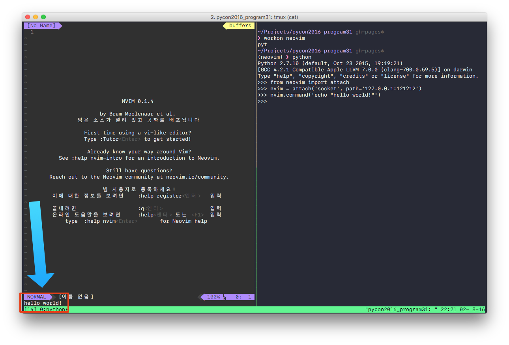

name: title
class: center, middle, inverse

# .title_upper[Python으로 만드는]<br>NEOVIM ASYNC PLUGIN
[PYCON 2016 APAC](https://www.pycon.kr/2016apac/)

.author[송재학 ([master@hpi.cc](mailto:master@hpi.cc))]

---
class: middle

# 발표자

## 송재학

* 현재 백수생활 중

* (전) 문래빗 주식회사 대표
  * 판타지x러너즈 for 카카오 서버 개발 (python)

* omnisharp-sublime (sublime text를 위한 C# IDE 플러그인)

---

class: center, middle

.logo[
  
]

--

class: center, middle
## 말그대로 vim의 미래
vim을 적극적으로 리팩토링한 superset

---

class: middle
# 현황
#### (2016.08.01 기준)

* stable version: v0.1.4
  * 안정적이고 실사용 가능함

* github repository
  * 활성화 되어있음
      * watch: 954
      * star: 19,471
      * fork: 1,374
---

class: middle
# 특징 

- **더 강력한 플러그인**

- 더 나은 기본 기능과 설정 

- 기본으로 내장된 embedding

- vim에서 쉽게 옮길 수 있음

---

class: middle

# 더 강력한 플러그인

* 오늘은 여기에만 집중해봅시다.

---

class: middle

# 더 강력한 플러그인
  
  * 핵심은 msgpack-rpc

---

class: middle

# msgpack-rpc
 * neovim은 서버로 동작함
 * stdin/stdout, socket을 통해 neovim의 RPC API를 사용할 수 있음

---

## 현재 API 클라이언트 모듈이 있는 플랫폼

* C#
* C++
* Clojure
* Common Lisp
* Elixir
* Filesystem
* Go
* Haskell
* Java
* Julia
* Lua
* Node.js
* Perl
* R
* Ruby
* Rust

...

---

class: middle

# 그리고 당연히 **Python**!!

---

class: middle

# Hello World!
### python-neovim 모듈을 사용해서 "Hello World!" 출력 해보기

---

# Hello World!
### 0. python-neovim 설치

```bash
> # python-neovim은 neovim의 RPC API을 사용하기  위한 모듈
> pip install neovim
```

--

### 1. neovim 실행

```bash
> # NVIM_LISTEN_ADDRESS: neovim의 RPC 주소 지정
> NVIM_LISTEN_ADDRESS=127.0.0.1:121212 nvim
```

--

### 2. python REPL에서 명령어 실행

``` python
> python
>>> from neovim import attach
>>> nvim = attach('socket', path='127.0.0.1:121212')
>>> nvim.command('echo "hello world!"')

```

---

# Hello World!

.right[[asciinema로 동영상 보기](https://asciinema.org/a/81579)]


---

class: middle
# "remote plugin"

--
## neovim의 msgpack-rpc를 통해 동작하는 plugin

---

class: middle
## 어떤 언어로든 쉽게 neovim plugin 개발 가능!!

---
class: middle

## 이미 여러 플러그인들이 Python으로 개발됨
### Floobits, deoplete, lldb.nvim, nvim-ipy, proteome.nvim ...

---
class: middle

## 간단한 플러그인을 만들어 봅시다

---

class: middle

## SimplePlugin 플러그인 예제

```python
# ~/.config/nvim/rplugin/python/simple.py

import neovim

@neovim.plugin
class SimplePlugin(object):

    def __init__(self, nvim):
        self.nvim = nvim

    @neovim.function('SimpleFunc')
    def func(self, args):
        self.nvim.command('echo "simple func"')

    @neovim.command('SimpleCommand', range='', nargs='*')
    def command(self, args, range):
        self.nvim.command('echo "simple command"')

    @neovim.autocmd('BufEnter', pattern="*.py")
    def autocmd(self):
        self.nvim.command('echo "simple autocmd"')
```

---

class: middle
### 파일 작성 후, neovim상에서
```vim
:UpdateRemotePlugins
```
### 해주면 플러그인이 동작합니다!

---

class: middle

## 참 쉽죠?

--

### 그래도 차근차근 살펴봅시다.

---

class: middle

## SimplePlugin 살펴보기- class 선언 

```python
import neovim
import time

@neovim.plugin
class SimplePlugin(object):

    def __init__(self, nvim):
        self.nvim = nvim
```

플러그인 class를 선언하고 생성자를 지정해 줍니다.

---

class: middle

## SimplePlugin 살펴보기- vim 함수 등록

```python
    @neovim.function('SimpleFunc')
    def func(self, args):
        self.nvim.command('echo "simple func"')
```

* vim 함수를 등록합니다.

--

#### 다른 vim 함수와 똑같이 사용할 수 있습니다.
```vim
:call SimpleFunc()
"simple func"

```

---

class: middle

## SimplePlugin 살펴보기- command 등록

```python
    @neovim.command('SimpleCommand', range='', nargs='*')
    def command(self, args, range):
        self.nvim.command('echo "simple command"')
```

* vim command를 등록합니다.

--

#### 마찬가지로, vim의 다른 command와 똑같이 사용할 수 있습니다.
```vim
:SimpleCommand
"simple command"
```
 
---

class: middle

## SimplePlugin 살펴보기 - autocmd 등록

```python
    @neovim.autocmd('BufEnter', pattern="*.py")
    def autocmd(self):
        self.nvim.command('echo "simple autocmd"')
```


* autocmd를등록합니다.
  * 이 경우에는 버퍼에 들어가는 경우 실행되는 autocmd 입니다.
  * 확장자가 py로 끝나는 경우에만 실행됩니다.

--

```vim
:help autocommand-events
```

명령어로 지원하는 이벤트를 확인할 수 있습니다.

